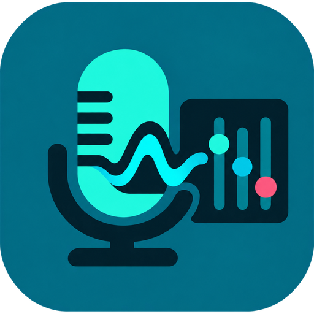

# VST-Applier

<p align="center">
  
</p>

VST-Applier is a Windows desktop voice changer that routes a real microphone through a mixed VST2/VST3 plugin chain and into a virtual audio cable. It is built for calls, streams, experiments, and the happy little chaos of making your voice sound less ordinary.

```text
Real microphone -> VST-Applier -> VST2/VST3 chain -> CABLE Input -> CABLE Output -> Meet / Discord / Chrome
```

## Download

Get the latest build from the [Releases page](https://github.com/YousefMohiey/VST-Applier/releases):

- `VstApplier_v0.1.0_win-x64.zip` - portable build: extract anywhere and run `VstApplier.exe`.
- `VstApplier_v0.1.0.exe` - installer: installs into `Program Files`, creates shortcuts, and can optionally launch the bundled VB-CABLE driver installer on the final setup screen.

## Requirements

- Windows 10/11 x64.
- VB-Audio Virtual Cable or a compatible virtual audio cable.
- 64-bit VST2 `.dll` plugins and/or VST3 `.vst3` plugins if you want effects in the chain.

VB-CABLE creates two important Windows audio endpoints:

- `CABLE Input` - playback/output device used by VST-Applier.
- `CABLE Output` - recording/input device used by Meet, Discord, Chrome, OBS, etc.

VST-Applier sends processed audio to `CABLE Input`. Your call or recording app should use `CABLE Output` as its microphone.

## Quick Start

1. Download and run the installer from [`dist`](dist).
2. Leave `Install VB-CABLE virtual audio driver` checked if VB-CABLE is not installed yet.
3. Launch VST-Applier.
4. Select your real microphone in `InputDevice`.
5. Select `CABLE Input` in `OutputDevice`.
6. Press `Start`.
7. In Google Meet, Discord, Chrome, OBS, or another app, select `CABLE Output` as the microphone.
8. Add VST2 or VST3 plugins to the chain if you want voice effects.

For best results, set your microphone and VB-CABLE endpoints to the same sample rate in Windows sound settings, preferably `48000 Hz`.

## Features

- Real-time microphone routing.
- Input and output device selectors.
- VB-CABLE endpoint detection.
- Input and output level meters.
- Compact latency diagnostics.
- Recursive VST plugin folder scanning.
- 64-bit VST2 plugin support.
- VST3 plugin support.
- Mixed VST2/VST3 chain processing.
- Plugin editor windows.
- Plugin enable/disable checkboxes.
- Plugin reorder controls.
- Named setup profiles: create, save, load and delete full setups (devices, buffer size, plugin folder, plugin chain).
- Automatic session restore: devices, buffer size, plugin folder and the plugin chain come back on launch.
- Plugin parameter state is saved with every profile and restored on load.
- Single instance: launching the app again brings the running window to the front instead of starting a second copy.
- Close to tray: closing the window keeps the app running in the system tray.
- Settings dialog: auto-start microphone routing, close-to-tray, and start with Windows.
- Dark Windows desktop UI.
- Self-contained installer with desktop and Start Menu shortcuts.

## Profiles and Settings

Everything is stored under `%APPDATA%\VstApplier`:

- `session.json` - automatic snapshot of the last setup, written when the app closes.
- `profiles\<name>.json` - named profiles saved from the Profile row.
- `settings.json` - app preferences from the Settings dialog.

The Profile row at the top of the main panel has a dropdown plus `Save`, `Save as` and `Delete`. Selecting a profile loads the full setup, including each plugin's parameter state.

The `Settings` button at the bottom of the main panel controls:

- `Start microphone routing automatically when the app opens` - presses Start for you.
- `Keep running in the system tray when the window is closed` - close-to-tray behavior.
- `Start with Windows (opens minimized to tray)` - registers the app in the Windows startup list.

When the app is in the tray, double-click the tray icon to reopen the window or right-click it to exit completely.

## VST Plugins

The app scans the selected plugin folder recursively. The default bundled layout is:

```text
common/VST/vst2
common/VST/vst3
```

VST2 candidates are accepted only when they are 64-bit Windows DLLs and export `VSTPluginMain` or legacy `main`. VST3 candidates are loaded from `.vst3` modules.

Some host-specific plugins may not behave like normal portable VST plugins. In particular, Cockos/ReaPlugs VST2 editors can render incomplete slider controls in this lightweight host, even when audio processing works. Use standalone VST2 plugins or VST3 alternatives if a specific editor behaves oddly.

## Notes

VST-Applier does not install its own virtual microphone driver. It relies on VB-CABLE or another signed virtual audio cable. The bundled VB-CABLE installer is launched separately so you can choose whether to install the driver.

If the virtual cable was just installed, Windows may need a moment, an audio-device refresh, or a reboot before the new endpoints appear.

## Changelog

### v0.1.0

- First release.
- Named setup profiles: save, load and delete full setups (devices, buffer size, plugin folder, plugin chain).
- Automatic session restore, including each plugin's parameter state.
- Plugin state save/load for VST2 (chunk or parameter dump) and VST3 (component/controller state or parameter dump).
- Close to system tray: closing the window keeps the app running; tray menu has Open and Exit.
- Settings dialog: auto-start microphone routing on launch, close-to-tray toggle, and start with Windows.

## Development

Open `VstApplier.sln` in Visual Studio 2022 or newer.

Main projects:

- `VstApplier` - C# WinForms application.
- `Vst3HostNative` - native C++ VST3 host layer.
- `Vst2HostNative` - native C++ VST2 host layer.

Build notes live in [`docs`](docs). Installer scripts live in `publish`. The native VST3 host expects the Steinberg VST3 SDK under `third_party/vst3sdk`.

Standalone build without Visual Studio: install the .NET 9 SDK and the Visual Studio 2022 C++ build tools, fetch the VST3 SDK into `third_party/vst3sdk`, then run `publish/publish-self-contained.ps1`.
