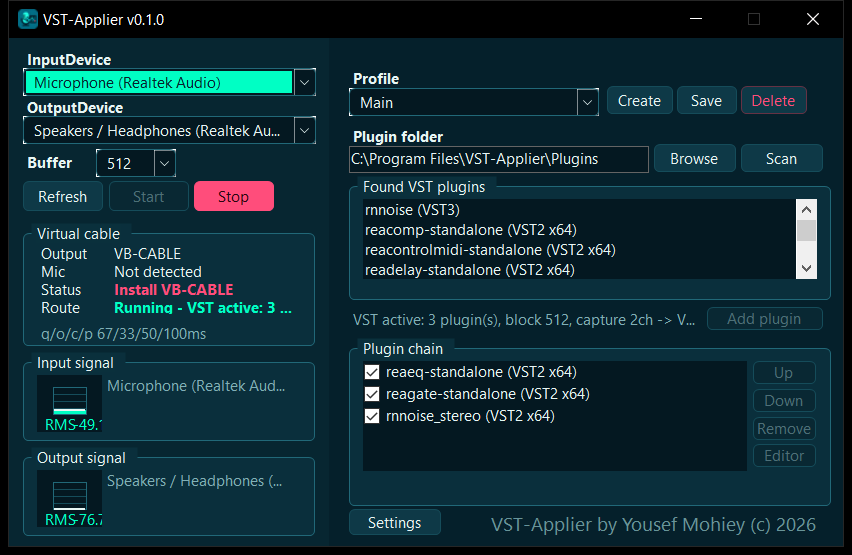

<p align="center">
  
</p>

<h1 align="center">VST-Applier</h1>

<p align="center">
  A real-time microphone plugin host for Windows: run a VST2/VST3 plugin chain on your mic and send the processed voice to any app.<br>
  Make your voice sound better (cleaner, clearer, noise-free) or load any plugins you like.
</p>

<p align="center">
  <a href="#requirements"></a>
  <a href="https://github.com/YousefMohiey/VST-Applier/releases"></a>
  <a href="#development"></a>
</p>

<p align="center">
  
</p>

---

```text
Microphone -> VST-Applier -> VST2/VST3 chain -> CABLE Input -> CABLE Output -> Discord / Meet / Chrome / OBS
```

## Features

- Real-time microphone routing through a mixed VST2/VST3 plugin chain.
- Make your voice sound better: the bundled Main profile cleans it up with EQ, gate and noise suppression.
- Works with any VST2/VST3 plugins you own, not just the bundled ones.
- Plugin editor windows, per-plugin enable/disable checkboxes, reorder controls.
- Named profiles: Create, Save and Delete full setups (devices, buffer size, plugin folder, chain), including every plugin's parameter state.
- Session restore: the whole setup comes back on launch, plugins and parameters included.
- Single instance: launching the app again brings the running window to the front instead of starting a second copy.
- Cable session guard: other apps that play into the virtual cable (for example Discord) are muted automatically, so their audio never leaks into your mic. On by default.
- Close to tray, start with Windows, and auto-start microphone routing.
- Bundled plugins out of the box: Cockos ReaPlugs and rnnoise noise suppression.
- Input/output level meters and compact latency diagnostics.
- Dark UI, self-contained build, no runtime to install.

## Download

Both builds are on the [Releases page](https://github.com/YousefMohiey/VST-Applier/releases):

| Build | What it is |
| --- | --- |
| `VstApplier_v0.1.0.exe` | Installer: installs into Program Files, creates shortcuts, and can optionally launch the bundled VB-CABLE driver setup on the last page. |
| `VstApplier_v0.1.0_win-x64.zip` | Portable: extract anywhere and run `VstApplier.exe`. |

## Requirements

- Windows 10/11 x64.
- VB-Audio Virtual Cable (VB-CABLE) or another signed virtual audio cable.
- Optional: your own 64-bit VST2 `.dll` / VST3 `.vst3` plugins. A useful set ships with the app already.

VB-CABLE creates the two endpoints the routing needs:

| Endpoint | Role |
| --- | --- |
| `CABLE Input` | Playback device. VST-Applier sends your processed voice here. |
| `CABLE Output` | Recording device. Discord, Meet, Chrome and OBS pick this as the microphone. |

## Quick start

1. Install with the installer. Leave `Install VB-CABLE virtual audio driver` checked if you do not have the cable yet.
2. Launch VST-Applier. On first run the `Main` profile (a tuned ReaEQ -> ReaGate -> rnnoise chain) is already loaded.
3. Select your real microphone as `InputDevice` and `CABLE Input` as `OutputDevice`.
4. Press `Start`. If the auto-start setting is on, it is already running.
5. In Discord, Meet, Chrome or OBS, select `CABLE Output` as the microphone.

For best results, set your microphone and the VB-CABLE endpoints to the same sample rate in Windows sound settings, preferably 48000 Hz.

## Profiles and settings

Everything is stored under `%APPDATA%\VstApplier`:

| File | Contents |
| --- | --- |
| `session.json` | Automatic snapshot of the last setup, written when the app closes. |
| `profiles\<name>.json` | Named profiles from the Profile row. |
| `settings.json` | App preferences from the Settings dialog. |

The Profile row at the top of the main panel has a dropdown plus `Create`, `Save` and `Delete`:

- `Create` makes a new empty profile (zero plugins) and equips it, clearing the chain so you build it fresh.
- `Save` writes the current setup to the equipped (selected) profile.
- `Delete` removes the selected profile.
- Selecting a profile loads the full setup, including each plugin's parameter state. If you switch with unsaved changes, the app asks whether to save them first, so edits always end up in the profile you intended.

The `Settings` button at the bottom of the main panel controls:

- `Start microphone routing automatically when the app opens`.
- `Keep running in the system tray when the window is closed`.
- `Start with Windows (opens minimized to tray)`.
- `Mute other apps on the virtual cable` - keeps apps like Discord out of the cable so their audio does not leak into the mic. On by default.

When the app is in the tray, double-click the tray icon to reopen the window, or right-click it to exit completely.

## Bundled plugins

The app scans the selected plugin folder recursively. Plugins ship inside the install folder:

```text
Plugins/ReaPlugs              Cockos ReaPlugs VST2 suite (ReaEQ, ReaComp, ReaGate, ...)
Plugins/rnnoise/vst           rnnoise noise suppression (VST2 mono + stereo)
Plugins/rnnoise/rnnoise.vst3  rnnoise noise suppression (VST3 bundle)
```

The plugin folder points at this bundled `Plugins` folder by default, so the plugins are ready on first launch. You can point the folder anywhere and press `Scan`.

- VST2 plugins are accepted when they are 64-bit Windows DLLs exporting `VSTPluginMain` or legacy `main`.
- VST3 plugins are loaded from `.vst3` modules; bundles (`.vst3` folders) resolve to the binary inside them automatically.

Note: Cockos/ReaPlugs editors can render incomplete slider controls in this lightweight host even though audio processing works fine. If a specific editor behaves oddly, prefer standalone VST2 plugins or VST3 alternatives.

## Default setup

On first launch the app installs its bundled defaults if no settings or profiles exist yet:

- the `Main` profile: a tuned ReaEQ -> ReaGate -> rnnoise chain with a 512-sample buffer;
- the matching session, so the app opens with that profile loaded;
- default settings: auto-start microphone, close-to-tray, start with Windows, mute other apps on the cable.

The templates live in `defaults/` next to the executable; an `{APP}` placeholder is replaced with the install folder when seeded. Existing settings and profiles are never overwritten.

## Notes

- VST-Applier does not install its own virtual microphone driver. It relies on VB-CABLE or another signed virtual audio cable; the bundled VB-CABLE setup is launched separately so you can choose.
- After installing the virtual cable, Windows may need a moment, an audio-device refresh, or a reboot before the new endpoints appear.
- Windows volume is per-app: if another app still shows up on the cable, the `Mute other apps on the virtual cable` setting handles it automatically.
- Smooth under load: while routing, the app registers its audio thread with the Windows multimedia scheduler and keeps the routing delay bounded, so heavy CPU use (games, streaming, builds) does not make the microphone lag. If a machine still glitches under extreme load, raising `Buffer` to 1024 or 2048 makes the processing block more forgiving.

## Development

Open `VstApplier.sln` in Visual Studio 2022 or newer.

Main projects:

| Project | Role |
| --- | --- |
| `VstApplier` | C# WinForms application (net9.0-windows, x64). |
| `Vst3HostNative` | Native C++ VST3 host layer. |
| `Vst2HostNative` | Native C++ VST2 host layer. |

Build notes live in [`docs`](docs); installer scripts live in `publish`. The native VST3 host expects the Steinberg VST3 SDK under `third_party/vst3sdk`.

Standalone build without Visual Studio: install the .NET 9 SDK and the Visual Studio 2022 C++ build tools, fetch the VST3 SDK into `third_party/vst3sdk`, then run `publish/publish-self-contained.ps1`.

## Changelog

### v0.1.0 (current)

- First release.
- Bundled plugins: Cockos ReaPlugs (VST2) and rnnoise noise suppression (VST2 + VST3) ship with the app; the plugin folder points at them by default.
- First-launch defaults: the Main profile (tuned ReaEQ -> ReaGate -> rnnoise chain) and settings are installed automatically when no settings or profiles exist yet.
- Named setup profiles: Create, Save and Delete full setups including plugin parameter state.
- Cable session guard: other apps on the virtual cable are muted automatically.
- Single instance and close to system tray.
- Settings dialog: auto-start microphone routing, close-to-tray, start with Windows, mute other apps on the cable.
- Smooth audio under CPU load: audio-thread priority via the Windows multimedia scheduler, bounded routing latency (old audio is dropped instead of accumulating delay), allocation-free audio processing and a mild process priority boost while routing.
